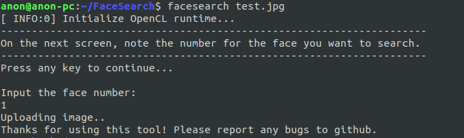

# FaceSearch
       █▀▀ █▀▀█ █▀▀ █▀▀   █▀▀ █▀▀ █▀▀█ █▀▀█ █▀▀ █  █       
       █▀▀ █▄▄█ █   █▀▀   ▀▀█ █▀▀ █▄▄█ █▄▄▀ █   █▀▀█       
       ▀   ▀  ▀ ▀▀▀ ▀▀▀   ▀▀▀ ▀▀▀ ▀  ▀ ▀ ▀▀ ▀▀▀ ▀  ▀       

FaceSearch: Searches for faces in a given image using the Google Reverse Image Search engine.

## Installation

1. Directly download the latest release from the [releases](./releases) page.

  **OR**
2. First clone this repo. Now, to install the dependencies and create the alias for FaceSearch, run the `install.sh`.
  ``` bash
  bash install.sh
  ```

## Usage
Once it finishes, you can now use the following command on the terminal to detect and search for the faces in any image.
``` bash
facesearch path/to/Image
```
**Also**, note that the `path/to/Image` can be an internet URL as well! (prefixed with http: or https:)
So, you can just drag an image off the internet over the terminal to get its URL pasted over there and search for faces in it using FaceSearch. Really convenient.

## Examples
Test image:


On command line:
```
anon@anon-pc:~/FaceSearch$ facesearch example/test.jpg
[ INFO:0] Initialize OpenCL runtime...
Uploading image..
Thanks for using this tool! Please report any issues to github.
https://github.com/IAmSuyogJadhav/FaceSearch/issues
anon@anon-pc:~/FaceSearch$ Created new window in existing browser session.
█
```
Output Window:


In the browser:



Any feedback, bug reports and issues are welcome [here](./issues/new)!

## Updates
  - 05-08-18: A blog post detailing the implementation and working of FaceSearch is live now. Read it [here](https://mlendeavours.wordpress.com/2018/08/05/facesearch/).
  - 07-08-18: The project report is now ready! You can read it [here](./Project_Report.pdf).
  - 10-08-18: Added support for closing the output window by GUI [x] button.
  - 12-10-18: Thanks to Kaj, fixed an easy-to-miss bug. The script previously used the default system python; but, this caused an issue because of the `list.copy()` method not being defined in Python 2. Changed the script to explicitly use Python 3 now. Also, added a function in `install.sh` to remove any redundant aliases defined by the same name `facesearch`, to prevent problems occured because of running `install.sh` script multiple times.
  - 18-10-18: Created and released the first release of FaceSearch (v1.0). Directly downloadable from [here](./releases).

Image Source: [Rediff](http://im.rediff.com/getahead/2018/feb/26tanmay1.jpg)
